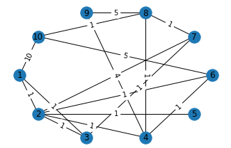

# Steiner Tree Problem

---
  
---

## Overview
The **Steiner Tree Problem** is a combinatorial optimization problem in graph theory and computational geometry. It seeks to find the shortest network (tree) that connects a given set of points (**terminals**) with optional inclusion of additional points (**Steiner points**) to minimize the total edge weight.

---

## Problem Definition

Given:
- A graph $G = (V, E)$ where:
  - $V$: Set of vertices
  - $E$: Set of edges
- A set of **terminal nodes** $T \subseteq V$
- A weight $w(e)$ for each edge $e \in E$

### Goal
Find a tree $S = (V_S, E_S)$ in $G$ such that:
1. $T \subseteq V_S$
2. $S$ minimizes the total weight:
   
   $$
   \text{Minimize} \quad W(S) = \sum_{e \in E_S} w(e)
   $$

### Constraints
- The tree must connect all terminals:
  
  $$
  T \subseteq V_S
  $$
- $S$ must be a connected acyclic subgraph.

---

## Variants

1. **Network Steiner Tree Problem**: 
   - The graph $G$ is explicitly defined, and weights are provided for edges.
2. **Euclidean Steiner Tree Problem**: 
   - The terminals are points in Euclidean space, and distances are based on the Euclidean metric. The total tree length $L$ is:
     
     $$
     L = \sum_{e \in E_S} \|p_i - p_j\|
     $$
     where $p_i, p_j$ are the coordinates of vertices connected by edge $e$.
3. **Rectilinear Steiner Tree Problem**:
   - Similar to the Euclidean problem, but distances are computed using the Manhattan metric.

---

## Complexity
- The Steiner Tree Problem is **NP-hard**.
- Exact solutions are computationally expensive for large graphs.

---

## Approximation Techniques

1. **Minimum Spanning Tree (MST) Approximation**:
   - Compute the MST of terminals as an upper bound for the Steiner tree cost.
2. **Shortest Path Heuristic**:
   - Iteratively connect terminals via shortest paths and merge connected components.
3. **Iterative Refinement**:
   - Start with an initial feasible solution and iteratively improve by adding/removing Steiner points.

---

## Applications
- **Network Design**: Telecommunications, power grids, and transportation.
- **Circuit Layout Optimization**: Efficient placement of components and connections.
- **Computational Biology**: Phylogenetic tree reconstruction.
